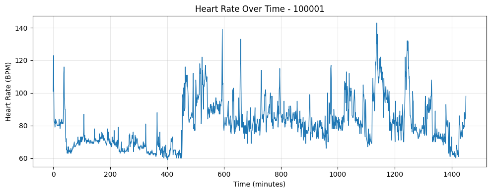

# ECG Signal Analyzer
> Computer Signal Processing term papers.

This project provides a comprehensive ECG signal analysis system designed for automated cardiac rhythm detection and evaluation. The system loads ECG recordings in WFDB format, applies digital filtering and normalization to clean the signals, then implements a Pan-Tompkins inspired algorithm to automatically detect R-peaks representing heartbeats. It calculates heart rate over time using sliding window analysis and generates time-series visualizations of cardiac rhythm patterns. The project supports both single-file analysis and batch processing of large ECG datasets, making it suitable for clinical research and routine cardiac monitoring. A key feature is the built-in validation system that compares algorithm performance against expert-annotated ground truth data, calculating precision, recall, and F1-scores to ensure clinical reliability. The system outputs structured results including detected peak counts, average heart rates, and comprehensive performance metrics, enabling healthcare professionals to efficiently analyze cardiac data and validate algorithm accuracy before clinical deployment.

## Installation

Pip:

```sh
pip install jupyterlab
jupyter lab
```

UV:

```sh
uv run --with jupyter jupyter lab
```

or

```sh
uv add --dev ipykernel
uv run ipython kernel install --user --env VIRTUAL_ENV $(pwd)/.venv --name=project
uv run --with jupyter jupyter lab
```

## Usage example

The notebook has a complete pipeline ready to run. Run the complete pipeline like this:
```python
run_ecg_pipeline()
```
Or run individual components:
```python
analyze_ecg_file("source1", "100001", plot=True)
batch_results = analyze_ecg_batch("source1")
eval_results = evaluate_batch("source2", max_files=5, max_duration_hours=1.0)
anom_results = run_batch_analysis()
```


## Development setup

Clone this repository and install dependencies.

Pip:

```sh
pip install -r requirements.txt
```

UV:

```sh
uv venv
uv pip install -e .
```

## Release History

* 0.1.0
    * The first proper release
    * CHANGE: created proper README
* 0.0.1
    * Work in progress

## Meta

Martin Žoha – mates.zoha@gmail.com

Distributed under the GNU GPLv3 license. See ``LICENSE`` for more information.

[https://github.com/Zohino/](https://github.com/zohino/)

## Contributing

1. Fork it (<https://github.com/Zohino/pzs/fork>)
2. Create your feature branch (`git checkout -b feature/fooBar`)
3. Commit your changes (`git commit -am 'Add some fooBar'`)
4. Push to the branch (`git push origin feature/fooBar`)
5. Create a new Pull Request
